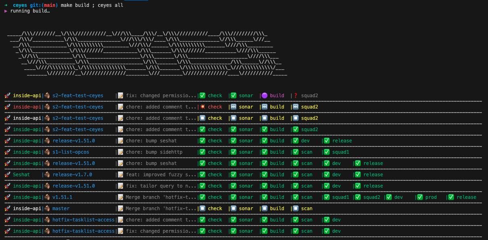

# CEYES 🕵️

This is a command-line interface (CLI) tool written in Go that allows you to view CI/CD pipelines. I was so tired of using gitlab's shitty interface and wanted to not be interrupted in my workflow when managing my CI/CD pipelines. Hence this project is a POC to visualise your gitlab pipelines for all your projects. As it goes on, I will keep on implementing new features such as cancelling specific jobs, relaunching failed jobs, etc. Potentially, I will create a UI as I think it will quickly get too complex to be managed via the cli. Let me know if you have any suggestion!



## Installation

To install this project, you need to have Go and Make installed on your machine. Then, clone the repository and build the project:

```bash
gcl https://github.com/VincentBaron/ceyes.git && cd ceyes && make build
```

This will create an executable named `ceyes` in your project directory.

## Usage

Here are the main commands provided by this tool:

#### Display All Ongoing Pipelines

```bash
./ceyes all
```

#### Display Your Ongoing Pipelines

```bash
./ceyes me
```

#### Display the Pipeline for a Specific Project

```bash
./ceyes project [project-name]
```

#### Add a Project to the Config

```bash
./ceyes add [project-name]
```

#### Remove a Project from the Config

```bash
./ceyes remove [project-name]
```

## Make Commands

This project uses a Makefile for managing build tasks. Here are some of the available commands:

```bash
make build // build the project
make clean // clean the project
make // clean + build
```

## Job Status Color Code

In the output of the program, each job status is represented by a different color and emoji:

- 🟣 Magenta: The job is currently running.
- 💥 Red: The job has failed.
- ✅ Green: The job has completed successfully.
- 👋 Blue: The job is in the 'other' status. This is a catch-all for statuses not covered by other colors.
- ⏳ White: The job is pending, meaning it is waiting to be processed.
- ⏹️ Yellow: The job has been canceled.
- ⏭️ Yellow: The job has been skipped.
- ❓ Black: The job is in an unknown status. This is used for any status not covered by the above cases.

The stage name is printed next to the emoji. If the stage name is 'production', it is shortened to 'prod'.

## Contributing

If you want to contribute to this project, please feel free to fork the repository, make your changes, and open a pull request.

## License

This project is licensed under the MIT License.

## TODO

- clean up stages display. Not working with tags CIs. Need a general approach.
- GET failed reasons
- Relaunch CIs
